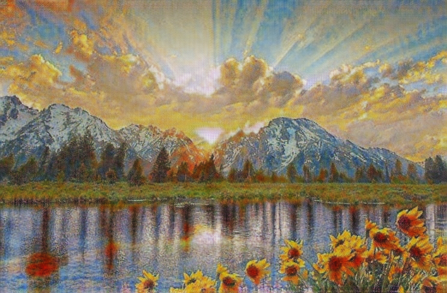

# 🌄 Gan Gough 🎨

Transforming Real Landscape Pictures into Monet-Style Paintings

---

## 🌟 Project Overview

**Gan Gough** is a deep learning project that brings the beauty of Monet's impressionist style to real landscape photos. This project leverages Generative Adversarial Networks (GANs) to create stunningly artistic transformations. The project was completed as part of the **Samsung Innovation Campus (SIC) AI Internship**, Batch No. AI603.



## 📂 Project Structure

- **gan-gogh.ipynb**: Jupyter notebook used for model training, run on Kaggle. The training process leverages pretrained weights for enhanced model performance and aesthetic quality.

- **app.py**: The Flask server application, enabling users to upload real landscape images and receive Monet-style paintings in return.
- **genM.pth.tar**: The required weights file for running the model, located in the project directory.

## 🛠️ Technical Overview

1. **Model Training**: Training was conducted using `gan-gogh.ipynb` on Kaggle, with GPUs for fast processing and pretrained weights for improved artistic transfer.
2. **Local Execution**: After training, the model was tested locally on a GPU.
3. **Deployment**: A Flask server (`app.py`) hosts the trained model, allowing real-time Monet-style transformations.

## 🚀 Getting Started

### Installation

1. Clone the repository:
   ```bash
   git clone https://github.com/your-username/gan-gough.git
   cd gan-gough
